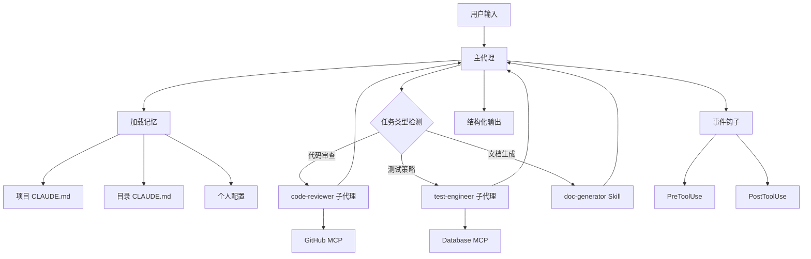
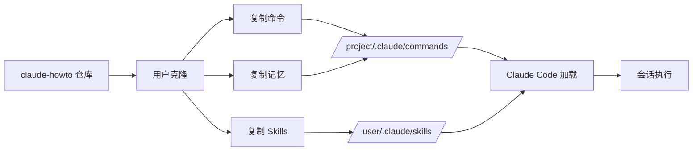

## 一、项目概述

### 1.1 项目定位

**Claude How To** 是一个革命性的 Claude Code 学习指南项目，由开发者 luongnv89 创建。它不是简单的功能文档，而是一个**结构化、可视化、示例驱动的教程系统**，旨在帮助开发者从 Claude Code 新手成长为能够编排 Agents、Hooks、Skills 和 MCP 服务器的专家级用户。

**核心价值主张**：

- 解决「安装了 Claude Code 但不知道如何充分发挥其能力」的问题
- 提供从基础概念到高级代理编排的渐进式学习路径
- 包含可直接复制使用的生产级模板配置

### 1.2 热度数据

| 指标 | 数值 |
|------|------|
| GitHub Stars | 12,807 |
| 今日新增 Stars | 2,390 |
| Fork 数 | 1,373 |
| 主要语言 | Markdown / Python |
| 活跃度 | 高度活跃（同步 Claude Code 版本更新） |
| 版本 | v2.2.0 (March 2026) |

### 1.3 目标用户

- **Claude Code 初学者**：刚安装工具，不知如何深入使用
- **团队技术负责人**：希望标准化团队 AI 编程工作流
- **DevOps 工程师**：需要自动化 CI/CD 集成
- **独立开发者**：追求高效单人开发流程

---

## 二、技术栈分析

### 2.1 核心技术组成

| 技术 | 用途 | 选择理由 |
|------|------|----------|
| **Markdown** | 教程内容载体 | Claude Code 直接读取，无需转换 |
| **Mermaid** | 流程可视化 | GitHub 原生渲染，静态无需 JS |
| **Python** | EPUB 构建脚本 | 快速开发，丰富生态 |
| **YAML Frontmatter** | 元数据管理 | Hugo 兼容，结构化配置 |
| **Shell Scripts** | Hooks 示例 | Claude Code 原生执行环境 |

### 2.2 依赖管理

```python
# requirements-dev.txt
pytest>=7.0
ruff>=0.1.0
bandit>=1.7
mypy>=1.0
coverage>=7.0
```

**选择分析**：
- **pytest**：单元测试标准框架
- **ruff**：极速 Linter + Formatter（替代 flake8 + black）
- **bandit**：安全漏洞扫描
- **mypy**：静态类型检查

### 2.3 构建工具链

| 工具 | 功能 |
|------|------|
| **uv** | Python 包管理（替代 pip） |
| **pre-commit** | Git 钩子自动化 |
| **GitHub Actions** | CI/CD 自动化 |
| **Codecov** | 覆盖率追踪 |

---

## 三、目录结构设计

### 3.1 模块化架构

```
claude-howto/
├── 01-slash-commands/      # 斜杠命令教程
├── 02-memory/              # 持久化记忆
├── 03-skills/              # 可复用能力
├── 04-subagents/           # 专用子代理
├── 05-mcp/                 # MCP 协议集成
├── 06-hooks/               # 事件驱动自动化
├── 07-plugins/             # 功能打包插件
├── 08-checkpoints/         # 会话快照与回滚
├── 09-advanced-features/   # 高级特性
├── 10-cli/                 # 命令行参考
├── scripts/                # Python 工具脚本
├── resources/              # 图片与资源
├── .claude/                # Claude 配置示例
├── .github/                # CI/CD 与社区配置
└── README.md               # 入口文档
```

### 3.2 编号系统设计理念

**为什么要编号？**

```
01 → 基础入门（Slash Commands）
02 → 核心机制（Memory）
03 → 能力扩展（Skills）
...
10 → 终极参考（CLI）
```

**设计原则**：
- **渐进式学习路径**：编号 = 学习顺序
- **认知负荷管理**：每模块聚焦单一主题
- **模块独立性**：可单独使用，也可组合

### 3.3 Claude 配置目录结构

```
.claude/
├── commands/               # 斜杠命令定义
│   ├── optimize.md
│   ├── pr.md
│   └── generate-api-docs.md
├── agents/                 # 子代理定义
│   ├── code-reviewer.md
│   ├── test-engineer.md
│   └── documentation-writer.md
├── skills/                 # Skills 定义
│   ├── code-review/
│   │   ├── SKILL.md
│   │   └── scripts/
│   └── brand-voice/
├── hooks/                  # 事件钩子脚本
│   ├── format-code.sh
│   └── pre-commit.sh
└── settings.json           # Claude Code 配置
```

---

## 四、核心模块拆解

### 4.1 Slash Commands 模块

**功能定位**：用户手动调用的快捷命令

**设计模式**：**命令模式 (Command Pattern)**

```markdown
# optimize.md 示例结构
---
name: optimize
description: 代码优化分析
---

## 优化目标
- 性能瓶颈识别
- 内存使用分析
- 算法复杂度评估

## 执行流程
1. 扫描项目代码
2. 识别热点函数
3. 提出优化建议
```

**模块职责**：
- 提供用户可调用的快捷命令
- 将复杂操作封装为简单 `/命令`
- 支持参数化配置

### 4.2 Memory 模块

**功能定位**：跨会话持久化上下文

**设计模式**：**状态持久化模式**

**三层记忆架构**：

```
项目级 (CLAUDE.md)
    ↓ 加载
目录级 (directory-CLAUDE.md)
    ↓ 加载
个人级 (~/.claude/CLAUDE.md)
    ↓ 合并
会话上下文
```

**关键文件**：

| 文件 | 作用范围 | 内容示例 |
|------|----------|----------|
| `project-CLAUDE.md` | 项目团队 | 编码规范、技术栈、工作流 |
| `directory-api-CLAUDE.md` | API 目录 | API 设计约定、RESTful 规范 |
| `personal-CLAUDE.md` | 个人偏好 | 常用命令别名、个性化配置 |

### 4.3 Skills 模块

**功能定位**：自动触发的可复用能力包

**设计模式**：**策略模式 (Strategy Pattern)**

**Skill 结构标准**：

```
skill-name/
├── SKILL.md        # Skill 定义（触发规则 + 指令）
├── scripts/        # 执行脚本
├── templates/      # 输出模板
└── README.md       # 使用说明
```

**核心 Skills 示例**：

| Skill | 触发条件 | 功能 |
|-------|----------|------|
| `code-review` | 提交代码/PR | 综合代码审查 |
| `brand-voice` | 撰写文档 | 品牌语气一致性检查 |
| `doc-generator` | 需生成文档 | API 文档自动生成 |

### 4.4 Subagents 模块

**功能定位**：专用子代理，隔离上下文执行特定任务

**设计模式**：**委托模式 (Delegation Pattern)**

**代理定义结构**：

```markdown
# code-reviewer.md
---
name: code-reviewer
description: 综合代码质量分析代理
tools: read, write, exec
permissions: read-only
---

## 职责范围
- 代码风格检查
- 安全漏洞扫描
- 性能问题识别
- 测试覆盖分析

## 输出格式
JSON 结构化报告 + Markdown 摘要
```

**代理协作架构**：

```
用户请求 → 主代理
              ↓ 分析任务类型
         ┌────┴────┐
         ↓         ↓
    code-reviewer  test-engineer
         ↓         ↓
         └────┬────┘
              ↓
         主代理综合 → 用户输出
```

### 4.5 MCP 模块

**功能定位**：Model Context Protocol 外部工具集成

**设计模式**：**适配器模式 (Adapter Pattern)**

**MCP 配置示例**：

```json
// github-mcp.json
{
  "mcpServers": {
    "github": {
      "command": "npx",
      "args": ["-y", "@modelcontextprotocol/server-github"],
      "env": {
        "GITHUB_TOKEN": "${GITHUB_TOKEN}"
      }
    }
  }
}
```

**支持的外部系统**：
- GitHub（PR、Issue、仓库操作）
- PostgreSQL 数据库查询
- 文件系统扩展
- 自定义 REST API

### 4.6 Hooks 模块

**功能定位**：事件驱动自动化

**设计模式**：**观察者模式 (Observer Pattern)**

**Hook 事件分类**：

| 类型 | 事件 | 用途 |
|------|------|------|
| **Tool Hooks** | PreToolUse, PostToolUse | 工具调用前后拦截 |
| **Session Hooks** | SessionStart, SessionEnd | 会话生命周期管理 |
| **Task Hooks** | TaskCompleted, UserPromptSubmit | 任务状态追踪 |
| **Lifecycle Hooks** | ConfigChange, FileChanged | 系统状态响应 |

**典型 Hook 脚本**：

```bash
# format-code.sh
#!/bin/bash
# PreToolUse Hook for Write operations

FILE_PATH="$1"
if [[ "$FILE_PATH" =~ \.(js|ts|py)$ ]]; then
    # 自动格式化代码
    ruff format "$FILE_PATH" 2>/dev/null || true
fi
```

### 4.7 Plugins 模块

**功能定位**：功能打包，一键安装完整解决方案

**设计模式**：**组合模式 (Composite Pattern)**

**Plugin 结构**：

```
plugin-name/
├── commands/      # 斜杠命令
├── agents/        # 子代理
├── skills/        # Skills
├── hooks/         # Hooks
├── mcp/           # MCP 配置
└── manifest.json  # 元数据
```

**一键安装**：

```bash
/plugin install pr-review
```

安装后自动获得：
- `/review-pr` 命令
- code-reviewer + test-engineer 代理
- GitHub MCP 配置
- 自动格式化 Hooks

---

## 五、设计模式分析

### 5.1 渐进式学习架构

**模式**：**分层架构 (Layered Architecture)**

```
Layer 1: 入门层 (Slash Commands)
    ↓ 掌握后
Layer 2: 理解层 (Memory + Checkpoints)
    ↓ 掌握后
Layer 3: 扩展层 (Skills + Hooks)
    ↓ 掌握后
Layer 4: 集成层 (MCP + Subagents)
    ↓ 掌握后
Layer 5: 专家层 (Plugins + CLI)
```

**学习时间规划**：

| 阶段 | 模块 | 预估时间 |
|------|------|----------|
| 入门 | 01-04 | 2.5 小时 |
| 中级 | 05-06 | 2 小时 |
| 高级 | 07-10 | 5.5 小时 |
| **总计** | 全部 | **11-13 小时** |

### 5.2 模块化组合模式

**设计哲学**：「简单组合，强大协作」

```
最小配置:
  Slash Commands → 15分钟上手

标准配置:
  Slash Commands + Memory → 30分钟配置

专业配置:
  Slash Commands + Memory + Skills + Subagents → 1小时

专家配置:
  全部功能 + MCP + Hooks → 周末完成
```

### 5.3 自评估反馈系统

**模式**：**闭环反馈 (Closed-loop Feedback)**

```
学习 → 自测 (/lesson-quiz)
         ↓
    识别知识缺口
         ↓
    定制学习路径
         ↓
    重新学习
         ↓
    再次自测 → 掌握
```

**Quiz 机制**：
- `/self-assessment`：全局能力评估
- `/lesson-quiz [topic]`：模块针对性测试

---

## 六、数据流与架构图

### 6.1 Claude Code 功能交互流



### 6.2 知识传播架构



### 6.3 EPUB 构建流程

```
Markdown 源文件
      ↓
Mermaid 渲染为 SVG
      ↓
Python 脚本处理
      ↓
EPUB 结构生成
      ↓
metadata.xml 配置
      ↓
claude-howto-guide.epub
```

---

## 七、依赖关系图

### 7.1 模块依赖矩阵

| 模块 | 依赖前置模块 | 原因 |
|------|--------------|------|
| Memory | Slash Commands | 需先理解命令系统 |
| Skills | Memory | Skill 需访问持久化记忆 |
| Hooks | Skills | Hook 需触发 Skill |
| Subagents | Skills + Memory | 子代理需调用 Skill 和记忆 |
| MCP | Subagents | MCP 需子代理使用外部数据 |
| Plugins | 所有模块 | Plugin 组合所有功能 |

### 7.2 外部依赖关系

```
claude-howto
    ↓
Claude Code (运行环境)
    ↓
Anthropic API (Claude 模型)
    ↓
MCP Servers (外部工具)
    ↓
GitHub API / Database / FileSystem
```

---

## 八、测试策略

### 8.1 测试框架架构

| 测试类型 | 工具 | 覆盖范围 |
|----------|------|----------|
| 单元测试 | pytest | Python 脚本逻辑 |
| 代码质量 | ruff | 代码风格检查 |
| 安全扫描 | bandit | 安全漏洞检测 |
| 类型检查 | mypy | 静态类型分析 |
| 覆盖率 | coverage + Codecov | 测试覆盖率追踪 |

### 8.2 CI/CD 测试流程

```yaml
# .github/workflows/test.yml
jobs:
  test:
    runs-on: ubuntu-latest
    steps:
      - uses: actions/checkout@v4
      - run: uv pip install -r requirements-dev.txt
      - run: pytest scripts/tests/ -v --cov
      - run: ruff check scripts/
      - run: bandit -r scripts/
      - run: mypy scripts/
```

### 8.3 测试覆盖率目标

| 指标 | 目标值 |
|------|--------|
| 代码覆盖率 | > 80% |
| 安全漏洞 | 0 高危 |
| 类型覆盖率 | > 90% |

---

## 九、性能考量

### 9.1 文档加载性能

**问题**：大量 Markdown 文件加载开销

**解决方案**：
- 模块化拆分，按需加载
- 使用 Mermaid（静态渲染，无 JS 运行时）
- GitHub 原生渲染，无第三方依赖

### 9.2 Claude Code 调用优化

**最佳实践**：
- Memory 文件精简（< 2000 行）
- Skill 指令精确触发（避免歧义）
- Subagent 权限最小化（只授予必要工具）

### 9.3 Hooks 执行性能

```bash
# 高效 Hook 设计原则
1. 快速失败：检测不匹配立即退出
2. 异步执行：非关键操作后台运行
3. 条件匹配：正则预筛选，减少全量处理
```

---

## 十、技术总结

### 10.1 架构亮点

| 特点 | 设计理念 | 效果 |
|------|----------|------|
| **编号模块化** | 渐进式学习路径 | 降低认知负荷 |
| **三层记忆** | 项目/目录/个人 | 精准上下文控制 |
| **组合式设计** | 简单→复杂递进 | 灵活配置级别 |
| **自评估闭环** | Quiz + 路径调整 | 个性化学习 |
| **Mermaid 可视化** | GitHub 原生渲染 | 无运行时开销 |

### 10.2 可借鉴设计

**教育项目设计**：
- 编号模块化结构
- 渐进式学习路径
- 自评估反馈系统

**配置管理设计**：
- 三层记忆架构
- 组合式功能包
- 一键安装机制

**文档工程实践**：
- Markdown + Mermaid 技术栈
- EPUB 离线阅读支持
- GitHub 原生渲染

### 10.3 潜在改进方向

| 方向 | 当前状态 | 改进建议 |
|------|----------|----------|
| 多语言支持 | 仅英文 | 添加中文、日文版本 |
| 视频教程 | 无 | 添加关键模块录屏 |
| 实时协作 | 无 | 添加多人学习进度同步 |
| AI 问答集成 | 无 | 嵌入 Claude API 交互练习 |

### 10.4 项目价值总结

**对个人开发者**：
- 快速掌握 Claude Code 全栈能力
- 从 15 分钟上手到周末精通
- 获得生产级配置模板

**对团队**：
- 标准化 AI 编程工作流
- 统一团队 Memory 规范
- 一键 Plugin 安装团队配置

**对社区**：
- 开源教程标杆
- 可 Fork 定制
- 活跃维护同步官方版本

---

## 参考资源

| 资源 | 链接 |
|------|------|
| GitHub 仓库 | https://github.com/luongnv89/claude-howto |
| Claude Code 官方文档 | https://code.claude.com/docs |
| MCP 协议规范 | https://modelcontextprotocol.io |
| 学习路线图 | https://github.com/luongnv89/claude-howto/blob/main/LEARNING-ROADMAP.md |
| 功能目录 | https://github.com/luongnv89/claude-howto/blob/main/CATALOG.md |

---

**分析时间**：2026-04-01 07:15 北京时间
**仓库热度**：12,807 stars | 2,390 stars today
**分析版本**：v2.2.0 (March 2026)